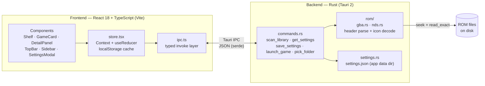

# PocketShelf

**A macOS-native ROM library manager for your own cartridge dumps (`.gba` / `.nds`).**

PocketShelf scans folders you choose, parses each ROM's binary header directly in Rust, extracts embedded NDS banner icons, and launches games in the emulator you configure — all in a fast, native desktop shell.

[](https://tauri.app)
[](https://www.rust-lang.org)
[](https://react.dev)
[](https://www.typescriptlang.org)
[](LICENSE)

> **Legal disclaimer:** PocketShelf is a tool for organizing and managing personal backup copies
> of game cartridges that you legally own and have dumped yourself. It does not include, bundle,
> link to, or facilitate the download of any copyrighted ROMs, BIOS files, or other copyrighted
> content. PocketShelf is an independent open-source project and is not affiliated with,
> endorsed by, or sponsored by Nintendo. "Game Boy Advance" and "Nintendo DS" are trademarks of
> Nintendo, used here only to describe file compatibility. Users are solely responsible for
> complying with the copyright laws of their jurisdiction.

---

## Features

- **Binary ROM header parsing in Rust** — no external tooling, no full-file reads. The scanner opens each file and reads only the bytes it needs (seek + `read_exact`), so even 512 MB `.nds` files are parsed in microseconds. Internal titles and 4-character game codes are decoded straight from the header.
- **NDS embedded icon extraction (4bpp tiled + BGR555)** — every `.nds` file carries a 32×32 banner icon. PocketShelf decodes it natively and renders it as a PNG. See [the deep dive below](#technical-showcase-nds-icon-extraction).
- **Smart title resolution** — for `.nds` files, the UTF-16LE banner title (English slot, falling back to slot 0) takes precedence over the ASCII header title, which falls back to the file stem. You see real titles, not file names.
- **Recursive library scan with dedup and stable IDs** — folders are walked recursively (`walkdir`), hidden files and symlinks are skipped, and each game gets a stable ID (truncated SHA-256 of its absolute path) that survives rescans.
- **Instant boot via local cache** — the library hydrates synchronously from `localStorage` while settings load over IPC; rescans are explicit, never surprise I/O.
- **One-click launch** — opens any ROM in the macOS emulator app you configure per platform (`open -a`), with discrete argv passing (no shell interpolation).
- **Native feel** — React 18 + Tailwind CSS v4 + [`motion`](https://motion.dev) layout animations inside a lightweight Tauri 2 shell. No Electron, no bundled Chromium.
- **Stateless, contract-frozen backend** — five Tauri commands behind a single typed IPC layer ([`src/ipc.ts`](src/ipc.ts)); the full wire contract is documented in [`docs/architecture.md`](docs/architecture.md).

## Technical showcase: NDS icon extraction

The `.nds` header stores a pointer to a *banner* block, which embeds the icon every cartridge shows in the handheld's menu. PocketShelf decodes it from raw bytes:

| Field | Offset | Size | Encoding |
|---|---|---|---|
| Header title | `0x00` | 12 B | ASCII, NUL-padded |
| Game code | `0x0C` | 4 B | ASCII |
| Banner offset | `0x68` | 4 B | `u32` little-endian |
| Icon bitmap | banner `+0x20` | 512 B | 4bpp, 4×4 grid of 8×8 tiles |
| Icon palette | banner `+0x220` | 32 B | 16 × `u16` LE, BGR555 |
| Title (slot 0) | banner `+0x240` | 256 B | UTF-16LE, NUL-terminated |
| Title (EN slot) | banner `+0x340` | 256 B | UTF-16LE, NUL-terminated |

**Decoding pipeline:** the 512-byte bitmap is a 4×4 grid of 8×8-pixel tiles stored tile-by-tile; each byte packs two pixels (low nibble first), each pixel a 4-bit palette index. The 16-color palette is BGR555 — 5 bits per channel, expanded to 8 bits with `(c5 << 3) | (c5 >> 2)`. Palette index 0 is fully transparent. The resulting 32×32 RGBA buffer is encoded as PNG (`png` crate) and shipped over IPC as base64. Any malformed banner degrades gracefully to `None` — a bad icon never fails a scan.

GBA headers have no icon, but their internal title (`0xA0`, 12 B) and game code (`0xAC`, 4 B) are parsed the same way. Implementation: [`src-tauri/src/rom/nds.rs`](src-tauri/src/rom/nds.rs) and [`src-tauri/src/rom/gba.rs`](src-tauri/src/rom/gba.rs), with unit tests against synthetic in-test fixtures.

## Screenshots

<!-- TODO: add screenshots to docs/screenshots/ and embed them here.
     Per docs/legal-guardrails.md §6: demo libraries must show only homebrew ROMs,
     original placeholder art, or generic titles — never commercial game artwork. -->

| Library shelf | Detail panel | Settings |
|---|---|---|
| _coming soon_ | _coming soon_ | _coming soon_ |

## Architecture



The backend is stateless between calls (settings live in a JSON file); the library is recomputed on every scan and cached frontend-side. The full frozen IPC contract — commands, structs, parsing spec — lives in [`docs/architecture.md`](docs/architecture.md).

## Getting started

**Prerequisites**

- macOS with Xcode Command Line Tools
- Rust (stable) — via [rustup](https://rustup.rs) or [mise](https://mise.jdx.dev) (`mise use -g rust`)
- Node.js 20+

```bash
git clone https://github.com/JBratzi/pocketshelf.git
cd pocketshelf
npm install
npm run tauri dev    # run the app (compiles the Rust backend on first run)
```

Other useful commands:

```bash
npm run build                  # typecheck + bundle the frontend
(cd src-tauri && cargo check)  # check the backend
(cd src-tauri && cargo test)   # run ROM-parser unit tests
npm run tauri build            # produce a .app bundle
```

> If Rust is installed via mise shims only, prefix cargo commands with
> `export PATH="$HOME/.local/share/mise/shims:$PATH"`.

## Emulator setup

PocketShelf launches ROMs with whatever macOS app you configure in Settings (it shells out to `open -a <App> <file>` — no emulator is bundled). Two solid open-source options, both installable via [Homebrew](https://brew.sh):

```bash
brew install --cask melonds   # accurate DS emulator
brew install --cask openemu   # multi-system frontend (handles .gba and .nds)
```

Then in **Settings**, set the emulator app name per platform (e.g. `melonDS` for `.nds`, `OpenEmu` for `.gba`). The default for both is `OpenEmu`.

## Legal

See the disclaimer at the top of this README and the full policy in [`docs/legal-guardrails.md`](docs/legal-guardrails.md). PocketShelf will never accept contributions that link to ROM sources, bundle copyrighted assets, or facilitate piracy.

## License

[MIT](LICENSE) © 2026 JBratzi.

## Contributing

Issues and PRs are welcome — read [`docs/architecture.md`](docs/architecture.md) (the frozen IPC contract) and [`docs/legal-guardrails.md`](docs/legal-guardrails.md) before submitting.
